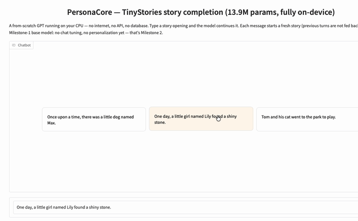

# PersonaCore

A conversational AI where memory lives in the model weights — no databases, no vector
stores, no external files: privacy by design. This repository is **Milestone 1**, the
from-scratch foundation — a 13.9M-parameter GPT built and trained entirely on-device; the
weight-memory mechanism itself (from-scratch LoRA + EWC) is **Milestone 2, upcoming**, and
its seams are already built in and tested.



## Results at a glance

- **13.9M parameters** — 13,891,584 exact, tied embedding counted once (6 layers, 6 heads,
  384-dim embeddings, 256-token context)
- **Deterministic full-validation perplexity 2.1066 over 12,636,922 scored target tokens**
  (50k-step `best.pt`, computed by `scripts/evaluate.py`)
- **~100 tok/s** streaming on a laptop CPU (measured 95–105) — a complete ~200-token story
  in about 2 seconds
- **Trained on-device** on Apple Silicon (fp32 / MPS) — zero external compute, zero budget
- **100% from-scratch PyTorch** — no HuggingFace model code anywhere in the runtime
- **Choices justified by ablation** — weight tying and positional embeddings both earn
  their parameters; the full four-run cohort (with its honest reduced-budget caveat) is in
  [docs/REPORT.md](docs/REPORT.md)

## What is this?

Every component is hand-implemented in pure PyTorch:

- **Byte-level BPE tokenizer** trained from scratch — vocab table 8192 with 547 ids live
  (256 bytes + 283 learned merges + 8 specials; the bounded TinyStories corpus exhausts its
  mergeable pairs, so the remaining 7645 rows are reserved capacity), `<|endoftext|>`
  pinned as an atomic id, validated against a tiktoken oracle (test-only; a guard test
  proves the oracle is never imported by runtime code)
- **GPT-style decoder** built by hand — pre-norm blocks, causal multi-head attention
  (masked before softmax), GELU MLP, weight tying as true shared storage
- **Hand-rolled training loop** — AdamW, warmup + cosine LR schedule, gradient
  clipping/accumulation, resumable open-dict checkpoints that restore RNG state bit-for-bit
- **One shared `generate()`** — greedy / temperature / top-k / top-p with EOS-stop, powering
  the tests, the notebook, and the demo identically
- **Per-component pytest suite** — causality, weight-tying storage identity, init scaling,
  oracle equivalence, resume trajectories (~130 CPU-only tests)
- **Offline Gradio demo** — streams TinyStories completions on localhost with zero outbound
  network calls

## Run the demo

After the install and the weights download, the demo itself makes zero network calls — it
works with Wi-Fi off.

```bash
# 1. Environment (Python 3.11)
python3.11 -m venv .venv
source .venv/bin/activate
pip install -e ".[cpu,demo]" --extra-index-url https://download.pytorch.org/whl/cpu

# 2. Weights — slim inference checkpoint (~55.6 MB) from the m1-demo-v1 release
gh release download m1-demo-v1 --pattern model_slim.pt --dir checkpoints
# or download model_slim.pt from
#   https://github.com/RAFAELDCOELHO/PersonaCore/releases/tag/m1-demo-v1
# and place it at checkpoints/model_slim.pt

# 3. Launch
python scripts/demo_app.py
# -> http://127.0.0.1:7860
```

The artifact loads with `torch.load(..., weights_only=True)` — plain tensors and containers
only, no code execution — and embeds its own `ModelConfig` plus the git SHA that produced
it. If you have a local training checkpoint (`best.pt`) instead, regenerate the artifact
with `python scripts/export_slim.py`.

## Evidence

- **[docs/REPORT.md](docs/REPORT.md)** — the decision-driven technical deep dive: every
  load-bearing choice with its rationale and the test, ablation row, or training curve that
  validates it
- **[demo.ipynb](demo.ipynb)** — the executed results notebook (rendered by GitHub): the
  model loaded from the slim artifact, exact parameter count, training curves, ablation
  plots, and a seeded sampling-settings tour
- **[results/](results/)** — committed evaluation artifacts: training-curve CSVs, the
  ablation cohort table, and qualitative samples (representative, not cherry-picked)

## Tests and reproducibility

```bash
make test    # full CPU-only suite (~70 s) — no GPU required
```

Reproducibility discipline: fixed seeds, the producing git SHA and full `ModelConfig`
embedded in every checkpoint (including the shipped slim artifact), and resume that
restores RNG state rather than re-seeding — an interrupted run continues its loss curve
bit-for-bit.

## Roadmap — Milestone 2 (upcoming)

Milestone 1 deliberately ships the sockets the thesis mechanism will plug into: six named
`nn.Linear` projections per block for LoRA, an `assemble_loss(base, extra_penalties)` seam
for EWC, and open-dict checkpoints for Fisher state. Milestone 2 — not yet implemented —
will add:

- **From-scratch LoRA adapters** — the weight-memory write mechanism
- **EWC continual learning** — the no-forgetting penalty, with A/B forgetting curves
- **Teach-then-recall demo** — teach the model a fact in conversation, wipe all context,
  and show it recalls the fact from weights alone

Until then, the demo above is exactly what it claims to be: honest story completion by the
Milestone-1 base model — no chat tuning, no personalization yet.
