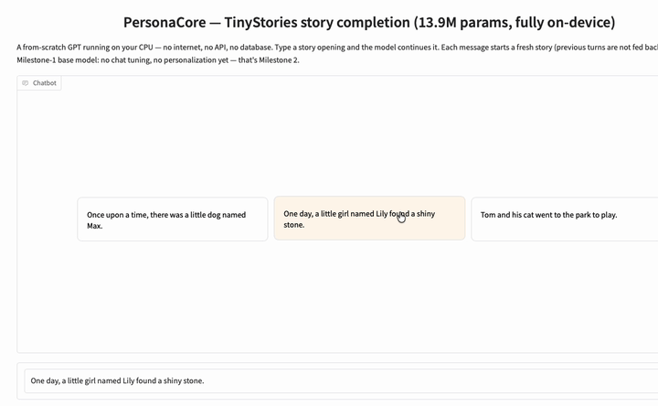
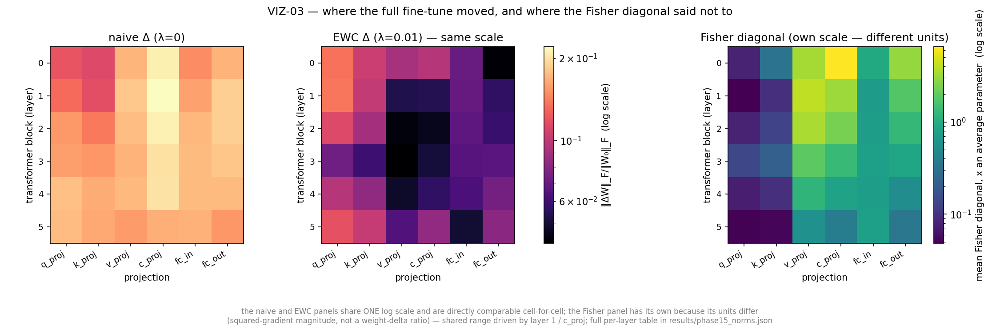
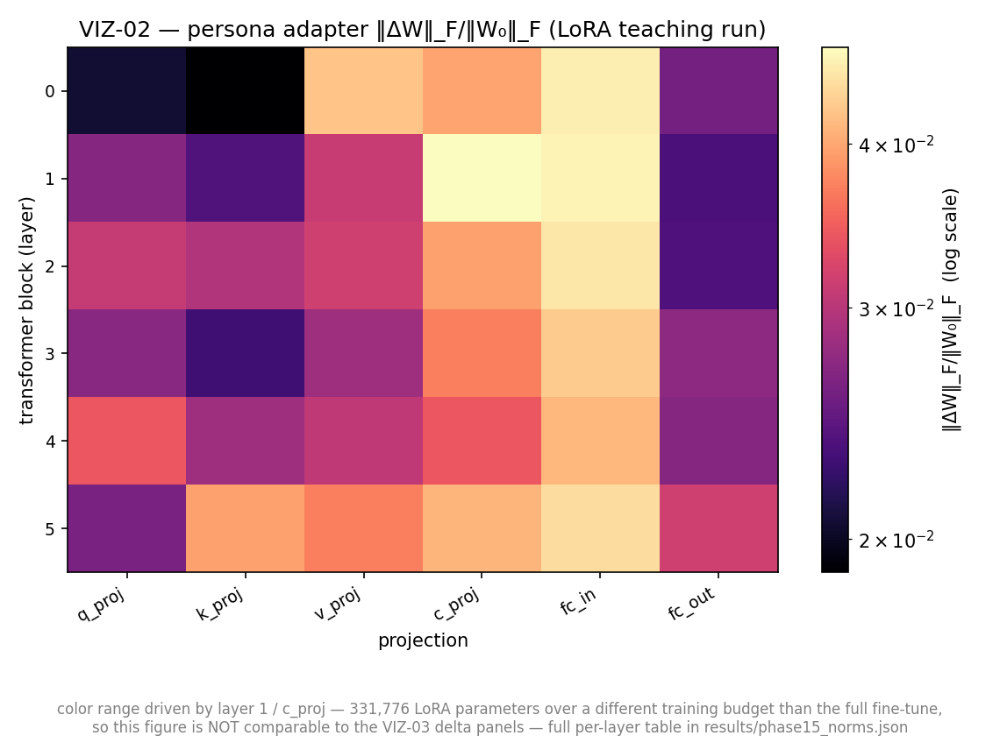

# PersonaCore

**TLDR.** A from-scratch GPT that runs on a laptop CPU. Personalization is in the weights, not a
database.

```bash
make demo
```

`make demo` creates `.venv` if needed, installs the CPU Gradio extras, downloads
`checkpoints/model_slim.pt` from the public `m1-demo-v1` release when that file is
absent (verifying its sha256 against the pin in `scripts/fetch_demo_checkpoint.py`
before installing it), and launches the TinyStories story demo at http://127.0.0.1:7860.
A second run does not re-download a present checkpoint. Story demo only: the teach-then-recall
app needs locally produced checkpoints that are not in that release.

PersonaCore is a from-scratch, on-device research system for studying parametric
personalization. It first demonstrated that synthetic profile values could be recalled from
LoRA weights without prompt-side facts. A subsequent adversarial audit found that 88.5% of
held-out questions were extractable under the strongest of four tested black-box attack
families, against a no-adapter control of exactly 0/104 — and that selective erasure of a
single fact destroyed 77.6% of the model's dialogue adaptation while failing to protect any
of seven non-target facts. The project therefore studies both the capabilities and the
privacy costs of weight-based memory.



## Results at a glance

- **Held-out recall 0.3483** (326/936) against a pre-registered gate of **0.2000**, taught
  recall **0.4921** (496/1008) against **0.2486**, and a closed-book control — the same
  weights with the adapter switched off — at exactly **0/2430**; both thresholds came from a
  *disjoint* calibration fact set fixed before the run existed. The rate covers the
  **proper-noun core only** (the soft preference tier is excluded from the gate) and the
  held-out set **deliberately omits reversed phrasings**, so it demonstrates generalization
  within that scope and makes no claim about reversed recall — counts in
  [results/phase14_recall_report.md](results/phase14_recall_report.md), full form of each
  bound in
  [docs/REPORT.md](docs/REPORT.md#milestone-2-limitations--nine-honest-negatives-quoted)
- **Naive fine-tuning drove retention perplexity to 8.52417066884246; EWC held it to
  3.8911400839446597** from the same step-0 anchor of 2.107553076833866 — drift **+6.416618**
  vs **+1.783587**, a **3.6×** difference, clearing the pre-registered margin at **33.61×**.
  That is **teacher-forced retention perplexity, not free-running story generation** (both
  arms leak role tokens mid-story), and the noise floor the margin is measured against was
  **not re-verified at the 4000-step production budget**; EWC's acquisition cost of
  **+0.380556** dialogue PPL is descriptive, with no gate — numbers in
  [results/phase13_ab_report.md](results/phase13_ab_report.md), full form of each bound in
  [docs/REPORT.md](docs/REPORT.md#milestone-2-limitations--nine-honest-negatives-quoted)
- **Dialogue costs 3.229 tokens/word** through the frozen v1.0 tokenizer (4,800,385 utterance
  tokens over 1,486,754 whitespace words) against a TinyStories baseline of **2.860**
  recomputed in the same run with the same tokenizer and the same word rule — a **1.129×**
  relative inflation, inside the pre-registered ≤1.2× GO band at a measured fit of 0.9996;
  the ratio is **only meaningful against that same-run baseline** and is never comparable to
  another tokenizer ([results/inflation_report.md](results/inflation_report.md))
- **13.9M parameters** — 13,891,584 exact, tied embedding counted once (6 layers, 6 heads,
  384-dim embeddings, 256-token context)
- **Deterministic full-validation perplexity 2.1066 over 12,636,922 scored target tokens**
  (50k-step `best.pt`, computed by `scripts/evaluate.py`)
- **~100 tok/s** streaming on a laptop CPU (measured 95–105) — a complete ~200-token story
  in about 2 seconds
- **Trained on-device** on Apple Silicon (fp32 / MPS) — zero external compute, zero budget
- **100% from-scratch PyTorch** — no HuggingFace model code anywhere in the runtime
- **Choices justified by ablation** — weight tying and positional embeddings both earn
  their parameters; the full four-run cohort (with its honest reduced-budget caveat) is in
  [docs/REPORT.md](docs/REPORT.md)

## Where the memory actually moved



*The naive and EWC delta panels share one color scale so the two arms are directly comparable; the Fisher panel has its own scale because squared-gradient importance is not a weight-delta ratio.*

Measured rather than eyeballed: across those 36 cells the rank correlation between Fisher
importance and how much EWC pulled the movement back is **ρ = 0.801544** (95% CI
[0.597984, 0.920291], rule and seed committed before the numbers existed) — a *rank*
correlation, not an effect size, and EWC in fact moved **further** than naive in 2 of the 36
cells.



*The persona adapter's own ‖ΔW‖_F/‖W₀‖_F grid, on an independent scale — it is not comparable to the panels above (different parameter counts, different training budgets), and the full reasoning is in [docs/REPORT.md](docs/REPORT.md).*

## What is this?

Every component is hand-implemented in pure PyTorch:

- **Byte-level BPE tokenizer** trained from scratch — vocab table 8192 with 547 ids live
  (256 bytes + 283 learned merges + 8 specials; the frozen production tokenizer
  `artifacts/tokenizer.json`, 5,648 bytes, was trained on the 11,469-byte fixture
  `tests/fixtures/tiny_corpus.txt` — `scripts/train_tokenizer.py:31` — and not on the full
  TinyStories corpus, which is why only 283 of the 7,928 requested merges were learned and
  the remaining 7,645 rows are reserved capacity), `<|endoftext|>` pinned as an atomic id,
  validated against a tiktoken oracle (test-only; a guard test proves the oracle is never
  imported by runtime code)
- **GPT-style decoder** built by hand — pre-norm blocks, causal multi-head attention
  (masked before softmax), GELU MLP, weight tying as true shared storage
- **Hand-rolled training loop** — AdamW, warmup + cosine LR schedule, gradient
  clipping/accumulation, resumable open-dict checkpoints that restore RNG state bit-for-bit
- **From-scratch LoRA adapters** — rank-8 wrappers over the six named projections per block
  (`q_proj`, `k_proj`, `v_proj`, `c_proj`, `fc_in`, `fc_out`), 331,776 trainable parameters
  against a base proven bit-untouched, with runtime toggle / merge / eject
- **From-scratch EWC** — per-example diagonal Fisher (N=2000) plus a Kirkpatrick quadratic
  anchor, spliced into the v1.0 loop through its `assemble_loss(base, extra_penalties)`
  seam with a bit-identical trajectory when the penalty is off
- **One shared `generate()`** — greedy / temperature / top-k / top-p with EOS-stop, powering
  the tests, the notebook, and the demo identically
- **Per-component pytest suite** — causality, weight-tying storage identity, init scaling,
  oracle equivalence, resume trajectories, adapter and Fisher invariants (~400 CPU-only
  tests)
- **Two offline Gradio demos** — story completion, and the teach-then-recall demo with its
  live memory ON/OFF toggle; both on localhost with zero outbound network calls

## Run the demo

After `make demo` has installed extras and downloaded weights, the demo itself makes
zero network calls — it works with Wi-Fi off.

```bash
git clone https://github.com/RAFAELDCOELHO/PersonaCore.git
cd PersonaCore
make demo
# -> http://127.0.0.1:7860
```

That is the default path. Optional fallback if you want to drive the steps by hand:

```bash
python3.11 -m venv .venv
source .venv/bin/activate
pip install -e ".[cpu,demo]" --extra-index-url https://download.pytorch.org/whl/cpu
mkdir -p checkpoints
curl -L -o checkpoints/model_slim.pt \
  https://github.com/RAFAELDCOELHO/PersonaCore/releases/download/m1-demo-v1/model_slim.pt
python scripts/demo_app.py
```

The artifact loads with `torch.load(..., weights_only=True)` — plain tensors and containers
only, no code execution — and embeds its own `ModelConfig` plus the git SHA that produced
it. If you have a local training checkpoint (`best.pt`) instead, regenerate the artifact
with `python scripts/export_slim.py`.

The teach-then-recall demo (`python scripts/personalize_demo.py`) runs the same way but
needs two locally produced checkpoints that are not in the `m1-demo-v1` release: the
conversational base (`checkpoints/convbase_slim.pt`) and the taught persona adapter
(`checkpoints/persona_adapter.pt`, 1.35 MB), produced by `scripts/finetune_dialog.py` and
`scripts/teach_persona.py`. Teaching happens in a *different* process from the demo, which
is what makes the clean room true by construction rather than by assertion.

## Evidence

- **[docs/REPORT.md](docs/REPORT.md)** — the decision-driven technical deep dive: every
  load-bearing choice with its rationale and the test, ablation row, or training curve that
  validates it, plus the Milestone 2 results narrative and every honest negative quoted
  from its source report
- **[demo.ipynb](demo.ipynb)** — the executed results notebook (rendered by GitHub): the
  model loaded from the slim artifact, exact parameter count, training curves, ablation
  plots, and a seeded sampling-settings tour
- **[results/](results/)** — committed evaluation artifacts: training-curve CSVs, the
  ablation cohort table, qualitative samples (representative, not cherry-picked), the EWC
  A/B report, the recall report with per-question counts, and
  `results/phase15_norms.json` — the committed grid of weight-delta and Fisher norms both
  figures above are plotted from

## Tests and reproducibility

```bash
make test    # full CPU-only suite — no GPU required
```

Reproducibility discipline: fixed seeds, the producing git SHA and full `ModelConfig`
embedded in every checkpoint (including the shipped slim artifact), and resume that
restores RNG state rather than re-seeding — an interrupted run continues its loss curve
bit-for-bit.

## Milestone 2 — what shipped

Milestone 1 deliberately built the sockets the thesis mechanism would plug into: six named
`nn.Linear` projections per block for LoRA, an `assemble_loss(base, extra_penalties)` seam
for EWC, and open-dict checkpoints for Fisher state. Milestone 2 plugged the thesis into
them and measured what came out:

- **From-scratch LoRA adapters** over those six projections — the weight-memory write
  mechanism, with a canary proving every trainable parameter moved and every frozen base
  parameter stayed bit-identical
- **From-scratch EWC** through the `assemble_loss` seam — per-example diagonal Fisher and a
  quadratic anchor, both hand-written and pinned against analytic oracles
- **The unconfounded no-forgetting A/B** — two 4000-step arms differing *only* in the
  penalty, with both axes reported (what each arm learned and what it destroyed) and the
  gate pre-registered in committed code before either run existed
- **The clean-room teach-then-recall demo** — a live memory ON/OFF toggle over the same
  weights, a one-way Reset, and a panel showing the exact prompt token ids, so a reviewer
  can watch the answer change while the prompt does not

### Honest next steps

- The recall gate covers the proper-noun core; the soft preference tier and reversed
  phrasings were not measured as held-out properties
- The retention result is teacher-forced perplexity; in free-running story mode both arms
  still leak role tokens, so qualitative retention is not claimed
- The tokenizer stays frozen from Milestone 1 at 547 live ids — retraining it would
  invalidate every checkpoint here, so the cost of keeping it was measured instead
- Every bound on every claim above is collected and quoted from its source report in
  [docs/REPORT.md](docs/REPORT.md#milestone-2-limitations--nine-honest-negatives-quoted)

## Claim correction — what the memory toggle demonstrates (recorded 2026-08-16)

**Appended, not edited.** Everything above stands as written for v2.0. Recorded text in this
project is corrected by dated note rather than in place, so no sentence above this line was
changed to make this section true.

The v2.0 text above presents the demo's live memory ON/OFF toggle over the same weights. The
mechanism it describes is accurate and is not amended: unchecking flips 36 boolean flags on the
adapter wrappers, reloads nothing, recomputes nothing, and leaves the prompt token panel
identical between the two states. What the toggle *demonstrates* is narrower than a switch
labelled ON/OFF invites a reader to assume.

The memory toggle is availability, not authorization: unchecking withholds the adapter's contribution from this process, it revokes no one's access to the weights and puts nothing beyond recovery.

Withholding a contribution is neither an access-control boundary nor erasure. With the box
unchecked, everything the adapter learned is still present in its 331,776 parameters, the 1.35 MB
file on disk is untouched, and anyone holding that file has white-box access — strictly more than
the checkbox ever gave away. The one-way Reset is a different mechanism with a different claim and
is outside this correction.

Phase 18 is the black-box audit measuring how much of the adapter's contents a prompt-only
attacker can recover, and its caveat is recorded here before its numbers exist: a low extraction
rate may be a property of LoRA at this capacity — 331,776 trainable parameters adapting a
13.9M-parameter base — rather than an achievement of PersonaCore's design, and that audit runs no
arm separating the two. The pinned wording is `LORA_PROPERTY_CAVEAT` in
`scripts/phase18_extraction.py`; the measured result and its interval are appended to
[docs/REPORT.md](docs/REPORT.md) through the same additive path when the run completes.

## v3.0 audit results (recorded 2026-08-19)

**Appended, not edited.** Everything above stands as written, including the anticipatory paragraph
that closes the section above this line. Recorded text in this project is corrected by dated note
rather than in place, so no sentence above was changed to make this section true.

**The audit ran, and it measured the opposite of a low rate.** The paragraph above anticipates a low
extraction rate and records its caveat before the numbers existed. The numbers now exist: across the
best attack family (`A2`) on the adapter-on arm, **92 of 104 `core_held_out` questions were
extracted at least once — 88.5%** (rate 0.884615), with a one-sided **95% Wilson lower bound of
0.8231**, against an adapter-off control arm — the same weights with the adapter switched off — at
exactly **0/104** questions at identical budget. The unit is the **question**: a question counts once
if any of its 48 draws contained the full value. The verdict is **`LEAKAGE_DEMONSTRATED`**, returned
by the pre-registered gate and published as such in
[results/phase18_extraction_report.md](results/phase18_extraction_report.md).

Black-box prompt access is the weakest threat model available here, so that number is a **floor on
leakage, never a ceiling on privacy**: anyone holding the 1.35 MB adapter file has white-box access —
gradients, per-token probabilities, direct parameter inspection — which is strictly more powerful
than anything the audit ran.

**The LoRA-capacity caveat still stands, re-scoped.** `LORA_PROPERTY_CAVEAT` is not withdrawn: this
audit still runs no arm separating a capacity property of LoRA from an achievement of PersonaCore's
design, and that gap is real. What the caveat no longer does is explain a low number, because there
was never a low number to explain. It was recorded to stop a comfortable result from reading as an
achievement; the result was not comfortable.

**Phase 19 — selective erasure attempted, verdict `FAILURE`, ship decision DO NOT SHIP.** Phase 19
tried to erase exactly one taught fact from the adapter and leave the rest intact. It could not: the
erasure was not localised to the fact, all seven non-target facts degraded past the pre-registered
margin, and 77.6370113463966% of the dialogue adaptation was destroyed. The phase is **closed and
honest, not blocked**. **DO NOT SHIP withholds exactly one claim, and it is the sole reason** — that
the `FAILURE` verdict is mechanically reproducible by the pinned script alone. It is not: the verdict
was reached on a hand-driven path around four published defects in that pin. **Nothing is
withdrawn** — the verdict, every measurement behind it and all four defects with their dated
corrections stand exactly as published, in
[results/phase19_erasure_report.md](results/phase19_erasure_report.md) and
[docs/REPORT.md](docs/REPORT.md).

## Pin defect labels — the phase publishes five, A through E (recorded 2026-08-19)

**Appended, not edited.** Everything above stands as written, including the Phase 19 paragraph that
closes the section above this line. Recorded text in this project is corrected by dated note rather
than in place, so no sentence above was changed to make this section true. This is a **labelling**
correction and it retracts nothing: no defect is added, none is withdrawn, no measurement moves.

**Phase 19 publishes five distinct defects in the closed pin `scripts/phase19_erasure.py`, and the
canonical labels are LETTERS.** They are fixed in
[results/phase19_erasure_report.md](results/phase19_erasure_report.md), section *Defect numbering —
the canonical labels*, which moved to letters because two different defects had each been published
as "the fourth" and no ordinal identified either one unambiguously.

| label | defect | line in the closed pin |
| --- | --- | --- |
| **A** | `zero_results_have_nll` compares an ORDERED tuple against records serialised with `sort_keys=True`, so it reads False on KEY ORDER ALONE while every NLL is present | `:1562` vs `:2948` |
| **B** | `_calibration_rate()` reads `record["pre_erasure"]["per_fact"]` — Phase 18's candidate recall — rather than the calibration arm's own rate | `:3850-3855` |
| **C** | `rows.update(per_fact_rows(...))` lets one (b) tier overwrite the other, and the pinned `report` subcommand SystemExits on the resulting rows | `:2922` |
| **D** | `_cmd_report` passes `retention_perplexity`'s `[ppl, n]` pair straight into the gate's scalar `retention_ppl=`, where the comparison raises `TypeError` | `:3811` |
| **E** | `_selected_components` reads the TARGET's stopping rule on the calibration twin's 6 members while reading every BYSTANDER on 8, inside one call | `:3576` |

**A**, **B** and **C** are published in
[results/phase19_calibration_correction.json](results/phase19_calibration_correction.json) as the
record keys `defects.A`, `defects.B` and `defects.C`; **D** in
[results/phase19_erasure_report.md](results/phase19_erasure_report.md); **E** in
[results/phase19_reference_set_correction.md](results/phase19_reference_set_correction.md).

**Four versus five — the distinction, stated rather than left to a reader.** **A**, **B**, **C** and
**D** are the four independent ways the pin's own `_cmd_report` cannot reproduce the `FAILURE`
verdict, and those four are what the ship decision enumerates. **E** sits in the `erase` subcommand
— a path that the render never called — so it cannot be one of the four ways the pinned report path
fails, and the phase nonetheless publishes five. Both counts are correct about different things,
which is exactly why the letters exist.

**What that makes of the phrasing above.** The section above records that the verdict "was reached
on a hand-driven path around four published defects in that pin", and that "all four defects with
their dated corrections stand exactly as published". Both sentences are correct about the four
`_cmd_report` failures — **A**, **B**, **C** and **D** — and both UNDERCOUNT the phase when read as
a complete enumeration of the defects it published, which is how they read here: unlike the erasure
report, README grants itself no in-file exemption. The earlier phrasing is left standing rather than
edited, per this project's dated-continuation discipline — an in-place correction would also erase
the evidence that the miscount was ever published.

**Nothing moves.** The verdict of record is still `FAILURE`, the ship decision of record is still
**DO NOT SHIP** and still withholds exactly one claim, no defect is added or withdrawn, and no
number above changes.
